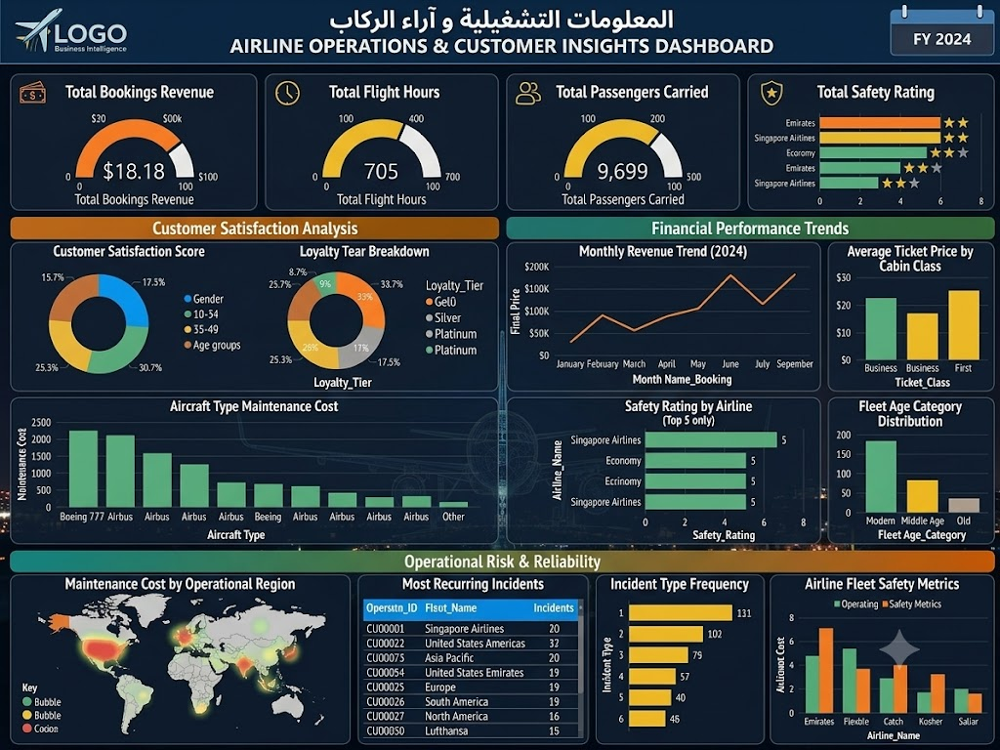

# ✈️ Airline Operations & Customer Insights Analysis

## 📌 Project Overview
An end-to-end data analytics project focused on cleaning, exploring, and visualizing comprehensive flight operations, passenger demographics, booking revenue, and customer satisfaction metrics.

---

## 🛠️ Tech Stack & Tools
* **Language & Libraries:** Python (Pandas, NumPy, Matplotlib, Seaborn)
* **IDE:** Jupyter Notebook (`final_project.ipynb`)
* **Visualization:** Executive Performance Dashboard (`airline.jpg`)
* **Data Source:** Multi-sheet Operational Dataset (`Final Project.zip`)

---

## 🧹 Key Data Processing Steps (Python)
* Integrated and cleaned 4 major operational tables (`Flights`, `Bookings`, `Customers`, `Airline_Operations`).
* Processed missing values, standardized datetime features, and structured age groups.
* Conducted exploratory metrics for ticket pricing, flight delays, and revenue streams by channel.

---

## 📊 Executive Dashboard Preview

---

## 💡 Business Impact & Key Insights
* **Operational Performance:** Categorized fleet age against maintenance costs to isolate regional risk factors.
* **Revenue Drivers:** Mapped booking channels and cabin classes against overall cancellation rates.
* **Customer Retention:** Evaluated customer satisfaction scores across loyalty tiers and travel frequency.
